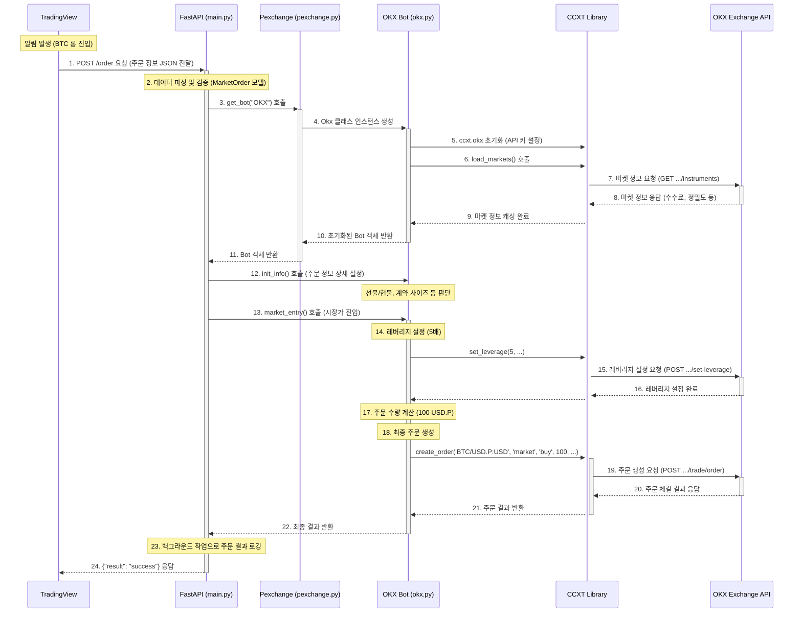

### 그래프 단계별 설명

1.  **요청 수신 (1~2)**: `TradingView`가 `main.py`로 주문 정보를 보냅니다. `main.py`는 이 데이터를 `MarketOrder` 모델에 맞춰 파싱하고 검증합니다.
2.  **객체 생성 및 초기화 (3~11)**: `main.py`는 `pexchange.py`를 통해 `okx.py`의 `Okx` 객체를 생성합니다. 이 과정에서 `ccxt` 라이브러리가 초기화되고, `load_markets()`를 통해 `OKX Exchange API`에서 모든 거래 규격 정보를 미리 받아와 캐싱합니다.
3.  **주문 준비 (12~17)**: `main.py`는 생성된 `Okx` 객체를 이용해 주문을 준비시킵니다. `market_entry` 함수가 호출되면, 먼저 레버리지를 5배로 설정하고, 최종 주문 수량을 계산합니다.
4.  **주문 실행 및 완료 (18~24)**: `ccxt`의 `create_order` 함수를 통해 실제 주문 요청이 `OKX Exchange API`로 전송됩니다. 거래소로부터 체결 결과를 응답받으면, `main.py`는 이 성공 내역을 로그로 기록하고 `TradingView`에 최종 성공 응답을 보냅니다.